# AppsScript-MailMerge

aka "Documentation Request App"

## Overview

- This Appsheet app and Apps Script solution lets your team manage a curated list of content from Google Drive, and then email PDFs of that content nicely packaged up for your audience. "Audience" could mean:

	- Onboarding for new hires
	- Technical content for training, business partners etc
	- Marketing and Product releases

- Furthermore, this app *optionally* performs a find and replace on variables inserted into multiple Google Docs and Google Sheets that you have attached to your templates, then makes copies of the files during the find and replace and stores those copies in a Drive output folder you have specified, and finally sends the merged results to your audience as PDFs. 

## High level steps


#### 1. Copy [this](https://www.appsheet.com/samples/A-Google-Drive-to-Email-application?appGuidString=ea7a1261-a798-4b80-bf16-5a8228266af7) Appsheet app to your gsuite account.


#### 2. Once copied, open Document sheets source.

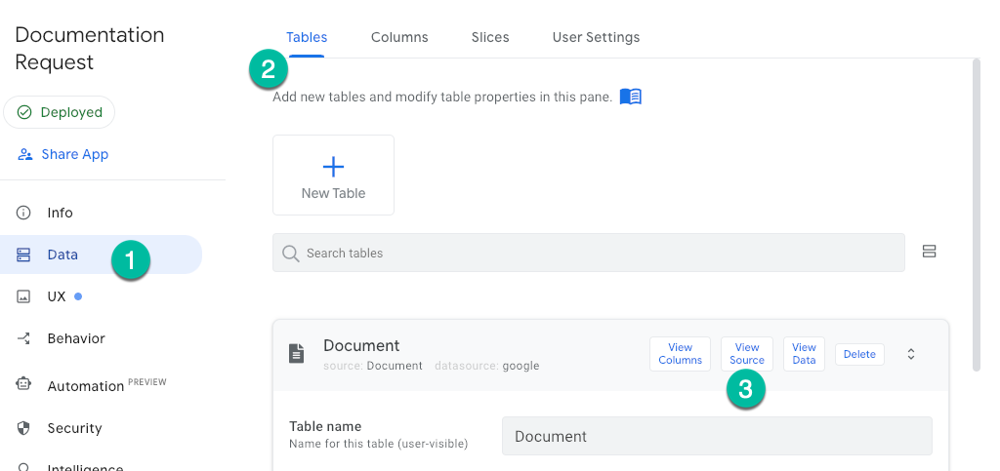


#### 3. Now in Google Sheets, go to the Extensions menu and choose Apps Script.

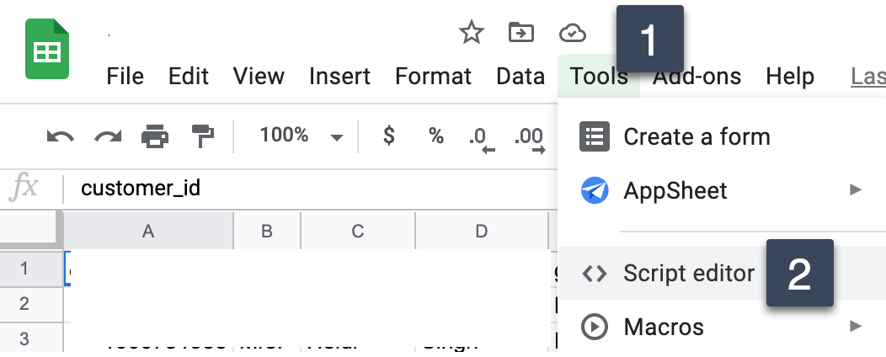

#### 4. Once Apps Script launches, paste in the entire contents of [getdocnamefromid.gs](https://raw.githubusercontent.com/northwestcoder/AppsScript-MailMerge/main/getdocnamefromid.gs) in this github project. Rename your project to any name you want. We named ours 'GetDocNameFromID'. Click the save icon.

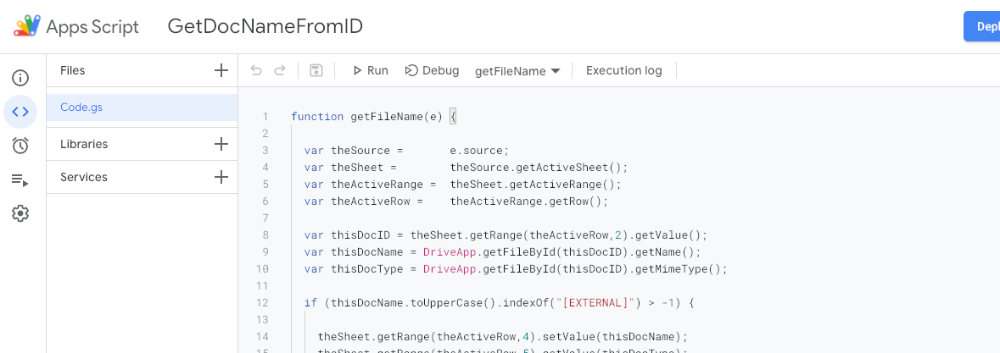


#### 5. Still in Apps Script, click the clock icon to set up a trigger.

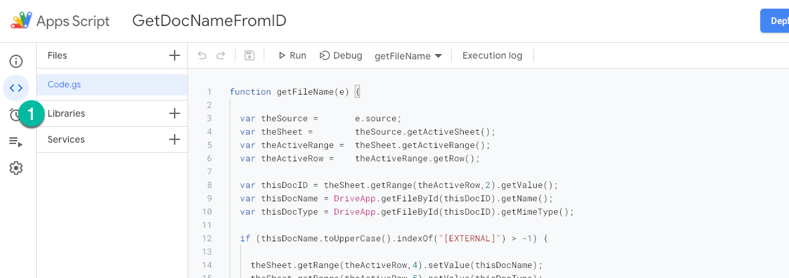

#### 6. On the triggers page, click "Add Trigger":


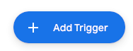


#### 7. And make the screen look exactly like this (except for the name which can be anything you want).

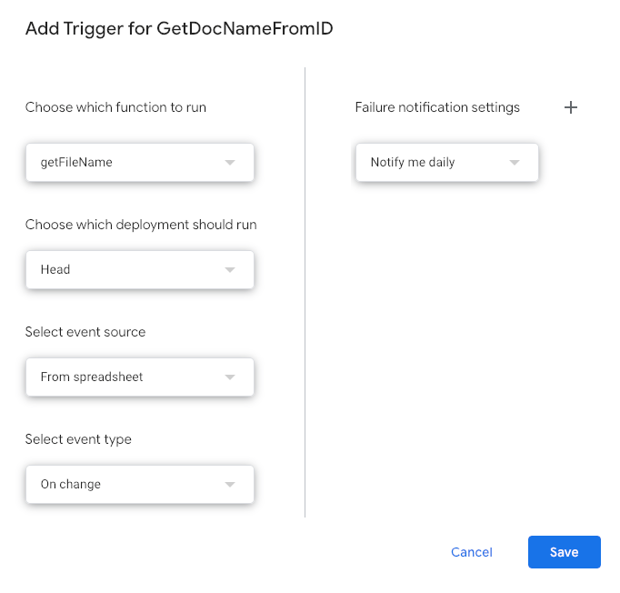

#### 8. Click save. You will be prompted to authenticate and verify the services that your G Suite account will have access to. Confirm all of this.


#### 9. Now we're going to repeat this process a second time. Back in Appsheet, find the data source called "Request", click source to open the Sheet.

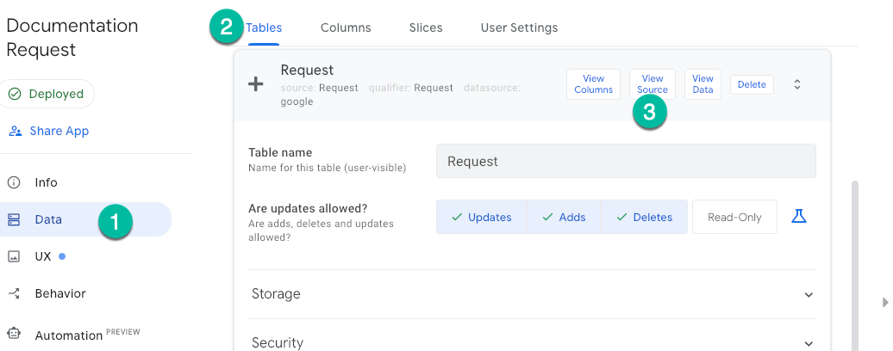

#### 10. Like we did above, in the sheet, go to the Extensions menu and choose Apps Script. Now we are going to create *four files and then paste in the four remaining files in this git project*:

- [columndictionary.gs](https://raw.githubusercontent.com/northwestcoder/AppsScript-MailMerge/main/columndictionary.gs)
- [email.gs](https://raw.githubusercontent.com/northwestcoder/AppsScript-MailMerge/main/email.gs)
- [main.gs](https://raw.githubusercontent.com/northwestcoder/AppsScript-MailMerge/main/main.gs)
- [parser.gs](https://raw.githubusercontent.com/northwestcoder/AppsScript-MailMerge/main/parser.gs)

#### 11. It turns out that Apps Script does not have strict approach to where your code should live, but we usually create multiple files whose purpose is modular - keep your room clean right? Basically, make your project look like the following; we called our project "Send Docs".

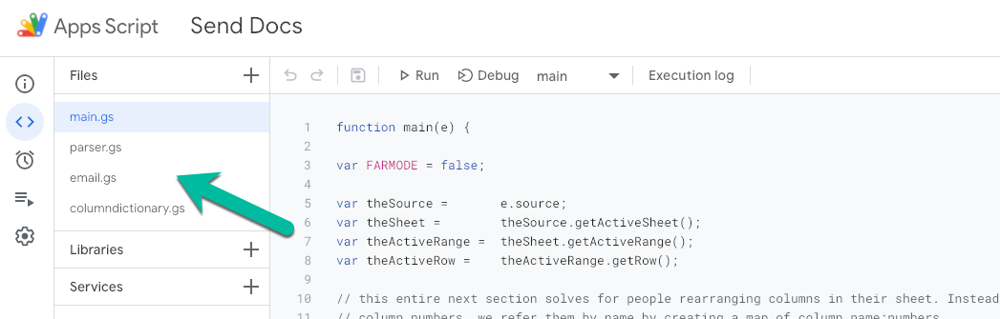


#### As long as all the code is in there and we have a file with our entry function `function main(e) {}` and then we specify this function in our trigger (next), it doesn't really matter how you organize your code/functions in Apps Script :) 


#### 12. Like we did above, set up a trigger for this second Apps Script project by clicking on the clock icon. Use the same settings as we used the first time:

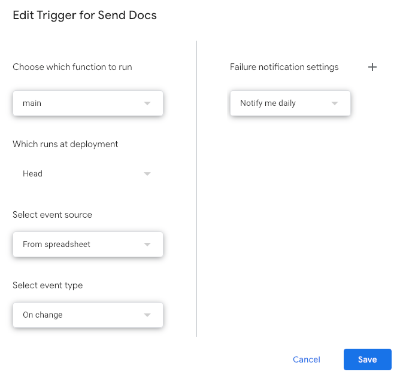


___


#### What you have just done above is create two script solutions that listen for data changes on Google Sheets. The first script listens for new Documents added to the document list (the Google Sheet "Documents") and verifies the document info. The second script listens for changes to Email Templates (the Google Sheet "Requests") and sends an email when certain conditions are met.

#### Now let's go back to Appsheet. We're ready to test.


#### When you first log into the app, click Start. you will then be prompted to create a new user record. This adds a new record to the Google Sheet named 'Globals'.


#### Once you have done so, you can create A) Documents, B) Links, and C) Email Templates of documents and links. We have created a first Email Template to get you started as well as one placeholder Google Doc and three Links. 


#### You can now add documents to your Document Library as well as links to your Link Library.


#### Data Elements

- The app has a strong concept of *private - my stuff* versus *public - shared for all app users* for these data types:

	- Documents
	- Links

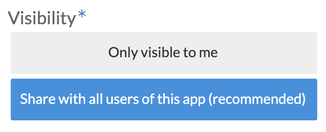


- In contrast, all Email Templates are currently private and operate on a per-user basis.


- In this manner you can now envision an environment where Documents and Links are shared across a community, but the email templates that use them are private and operate on a per-user basis. Neat.

#### Document behavior, Email behavior, and various other treasure hunts

- When adding a document to the Document Library, its Google Drive name _must_ include the phrase _[External]_ or else the app will reject it. We leave this as a fun exercise for you to figure out why, how, when and so forth. 

	- The business premise here is that this Appsheet app and Google Apps Script are powerful bridges to your Google Drive experience, and you should take business caution before unleashing this experience on a large group of operators. 
	- You don't want people sending confidential documents to your trading partners!
	- Note: you could easily send confidential docs from Drive directly without using this app, so this app is only an improvement over the curation experience for organizations managing Drive content. Or at the least, no worse from a security pov.

- To send an email, you need at least one document or one link attached to the template. Then the red magic "send email" button will appear.

- The display name "Email Templates" maps to the data source called "Requests". On Email Templates, in the data source , is a column called "LastSent" which toggles from its initial state of "Pending" to "SENDING EMAIL" when this script is triggered. On completion the script toggles this field back to "Pending". If you are testing this out, you can leave this Google Sheet open and you should see this change in realtime.

- We have deliberately omitted any strong sense of security or user management in the Appsheet app. This is meant to be implemented by you, the designer. Each user does get a private record in the Google Sheet called "Globals" - this maps to "Settings" in the App:

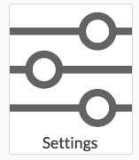

 - A record is created when you first log in and click the "Start" icon. There is also a "Settings" page with one single choice: whether or not ludicrous mode is OFF or ON. We have a seperate document on [ludicrous mode](media/ludicrousmode.pdf).

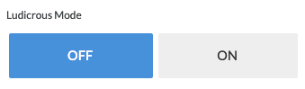

- Advanced extra credit: Appsheet has a [Rest API](https://help.appsheet.com/en/articles/1979979-invoking-the-api). Turn it on for this app! Now you can envision sending a post request which edits the table **Requests**, and you will be remotely generating Google Drive content as PDFs! The post request might look like so:

```
{
"Action": "Edit",
"Properties": {
   "Locale": "en-US",
   "Timezone": "Pacific Standard Time"
},
"Rows": [
{
"Key": "a316259a",
"Request Subject": "Your New Email Subject"
"SendTo": "yourrecipient@example.com",
"LastSent": "SENDING EMAIL"
}
]
}
```

#### Run-as account of the Appsheet app and the Google Script in relation to documents you attach

- Reminder: IF the owner of the Apps Script - let's call them jsmith@example.com - cannot see the Google Drive files that bobjones@example.com has attached to a template, THEN the email function of this app will fail silently. This is expected and proper behavior with this Google Appsheet app and Google Apps Script.

#### Emails marked as spam by your client? 

Yes, it could happen for a few reasons. 

- This solutions runs as a g suite user account. If that account is named something ridiculous or is known for spamming in general, that might be a problem here. 
- Email clients like Outlook and Gmail have all kinds of clever checks to determine if an email is spam, things like what is the subject line, is there any "robotic language" or harsh html formatting, or forms-like formatting, etc. Do not for example, name your email subject "Your TPS Report" :)

#### Silent Failures

From the Appsheet apps point of view, most if not all failures will be silent. From the Appscript point of view, you can always go to the "Executions" page of your script to review activities and errors. We assume that you will be making changes to this script solution and as part of that process, will be adding `Logger.log("your logging");` liberally througout this code. 


